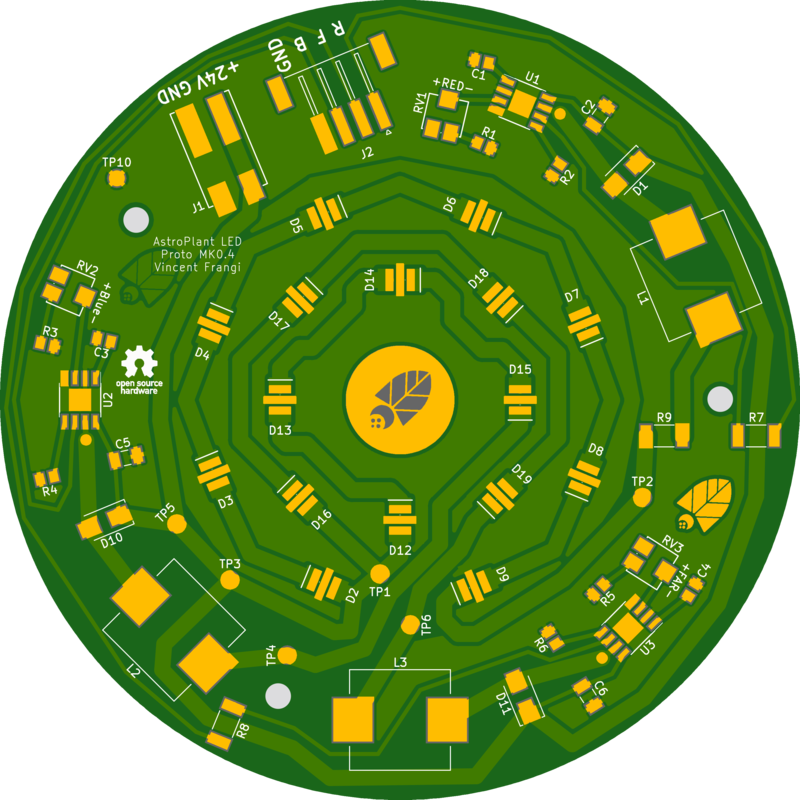
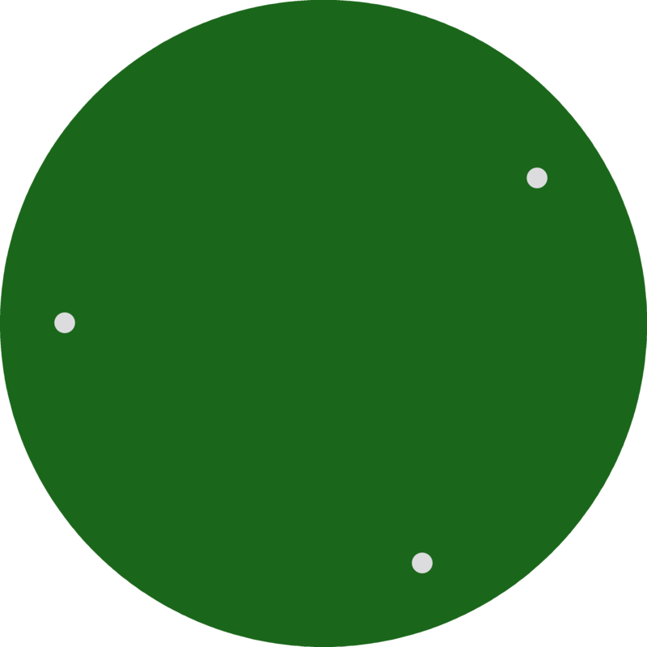

# Astroplant Led Aluminum

## About This Project

## Renderings

### Top

### Bottom

## BOM

|Count|Component|Details|Datasheet|
|-|-|-|-|
|3x|C1 / C3 / C4|CAP CER 1UF 25V X7R 0805|[Link](https://product.tdk.com/info/en/catalog/datasheets/mlcc_commercial_general_en.pdf)|
|3x|C2 / C5 / C6|CAP CER 2.7UF 25V X5R 1206||
|3x|D1 / D10 / D11|DIODE SCHOTTKY 2A 100V SMA||
|4x|D12 / D13 / D14 / D15|LED OSLON SSL120 BLUE 455NM SMD||
|4x|D16 / D17 / D18 / D19|LED OSLON SSL120 RED 727NM SMD||
|8x|D2 / D3 / D4 / D5 / D6 / D7 / D8 / D9|LED OSLON SSL120 RED 657NM SMD||
|3x|L1 / L2 / L3|FIXED IND 47UH 2.7A 100 MOHM SMD||
|1x|J2|CONN HEADER XH SMD 4POS 2.5MM||
|3x|R1 / R3 / R5|RES SMD 3.3K OHM 0.1% 1/8W 0805||
|3x|R2 / R4 / R6|RES SMD 43K OHM 0.1% 1/8W 0805||
|3x|R7 / R8 / R9|RES 0 OHM JUMPER 3/4W 2010||
|3x|RV1 / RV2 / RV3|TRIMMER 5K OHM 0.25W SMD||
|1x|U2|IC LED DRIVER RGLTR DIM 1A 8SO|[Link](http://www.ti.com/lit/ds/symlink/lm3414.pdf)|
|2x|U1 / U3|IC LED DRIVER RGLTR DIM 1A 8SO|[Link](http://www.ti.com/lit/ds/symlink/lm3414.pdf)|

---

This project is managed and available on

You can view it [here](https://aisler.net/p/KQLPCMKY). Start your own Powerful Prototype on [here](https://aisler.net).
